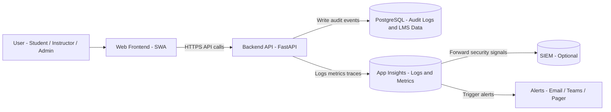

# Noventrax VLE/LMS  
## Audit & Logging Architecture (Flow + Events)

---

## 1. Purpose

This document defines how Noventrax VLE/LMS will implement **audit logging** and **operational logging** to ensure:

- Accountability and traceability (especially grades, roles, admin actions)
- Security monitoring and incident investigation
- Compliance readiness (GDPR-aligned governance)
- Reliable production operations (metrics, alerts)

It includes:

- Audit event taxonomy
- Logging flow diagram
- Minimum audit requirements per feature
- Storage and retention guidance
- Alerting triggers

---

# 2. Definitions

## 2.1 Audit Logs vs Operational Logs

### Audit Logs (Governance Evidence)
Audit logs record **who did what, when, to which record, and why**.

Characteristics:
- Append-only (no silent edits)
- Tamper-resistant
- Retained longer
- Must include actor identity

Examples:
- Role change
- Grade created/updated/overridden
- Course published/archived
- Admin access to sensitive records

### Operational Logs (System Health & Debugging)
Operational logs record system behaviour:

- Request metrics
- Errors and exceptions
- Service latency (including AI)
- Database failures
- Background job activity

Characteristics:
- Higher volume
- Shorter retention
- Used for monitoring and troubleshooting

---

# 3. Logging Flow Diagram (GitHub-safe Mermaid)

