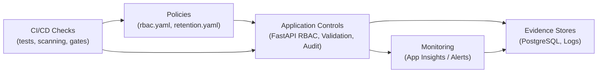

# Noventrax VLE/LMS  
## Framework as Code (Governance, Security & Compliance Automation)

---

## 1. Purpose

This document defines how Noventrax will implement its governance and security framework **as code** to ensure controls are:

- Repeatable
- Testable
- Auditable
- Consistent across environments (Dev/Test/Prod)

Framework as Code turns policy intent (documents) into enforceable controls in:

- Application code (FastAPI)
- CI/CD pipelines (GitHub Actions)
- Infrastructure (Azure configuration / IaC)
- Monitoring and alerting (App Insights / Azure Monitor)

---

## 2. Why Framework as Code is Appropriate for a VLE/LMS

A VLE/LMS processes regulated and high-value data:

- Personal data (identity, enrolments)
- Academic records (submissions, grades)
- Governance evidence (audit logs)
- AI interaction data (chat transcripts)

Manual governance is error-prone. Framework as Code reduces risk by ensuring:

- No endpoint is deployed without authorization controls.
- Sensitive actions always generate audit logs.
- Retention rules are enforced automatically.
- Security and privacy controls are continuously validated.

---

## 3. What Will Be Implemented “As Code”

### 3.1 RBAC as Code
- A central permission model defining what each role can do.
- Server-side enforcement on every protected endpoint.
- Ownership checks for user-scoped resources.

Example policy artefacts:
- `policies/rbac.yaml` (human-readable RBAC policy)
- `app/security/rbac.py` (enforcement helpers/dependencies)

---

### 3.2 Audit Logging as Code
- A mandatory audit event for high-risk actions:
  - role changes
  - course publish/unpublish/archive
  - staff-enrolments
  - grade create/update/override
  - admin access to sensitive records (including chat logs)

Example artefacts:
- `app/governance/audit.py` (audit writer)
- `db/audit_logs` table in ERD

---

### 3.3 Data Retention as Code
- Retention schedules defined in configuration.
- Automated deletion/anonymisation job.
- Policy-driven handling of conflicts with academic record retention.

Example artefacts:
- `policies/retention.yaml`
- `jobs/retention_cleanup.py` (scheduled)
- `jobs/user_data_export.py` and `jobs/user_data_delete.py` (GDPR workflows)

---

### 3.4 Security Controls as Code
- Server-side validation (Pydantic models + strict types).
- Server-side rate limiting (middleware).
- Environment-based CORS allowlists.
- Security headers (HSTS, CSP where appropriate).
- Secrets validation on startup (fail fast if missing).

Example artefacts:
- `app/security/middleware.py`
- `app/security/rate_limit.py`
- `app/config.py`

---

### 3.5 Infrastructure as Code (IaC)
- Reproducible environments and consistent security configuration.
- Resources include:
  - Static Web App
  - Container App / App Service
  - PostgreSQL
  - Blob Storage (private)
  - Key Vault
  - App Insights + Log Analytics

Example artefacts:
- `infra/bicep/` OR `infra/terraform/`

---

### 3.6 Policy Enforcement in CI/CD
CI must fail if critical controls are missing.

Examples:
- Tests verifying authorization required on protected endpoints.
- Tests verifying audit logs are written for sensitive actions.
- Dependency scanning and vulnerability alerts.
- Code scanning rules for secrets.

---

## 4. Proposed Repository Structure

```text
/docs
  context.md
  containers.md
  erd.md
  data-flow.md
  security.md
  rbac.md
  governance.md
  deployment.md
  framework-as-code.md

/backend
  app/
    main.py
    config.py
    api/               # routers/controllers
    services/          # business logic
    security/
      rbac.py
      middleware.py
      rate_limit.py
    governance/
      audit.py
      retention.py
  jobs/
    retention_cleanup.py
    user_data_export.py
    user_data_delete.py

/policies
  rbac.yaml
  retention.yaml

/infra
  bicep/ or terraform/

# 5. Control Map (Policy → Enforcement → Evidence)



# 6. Minimum Enforceable Controls (MVP Baseline)
# 6.1 Authorization Baseline

- All LMS endpoints require authentication.

- RBAC applied to:
  - course creation/publishing
  - enrolment management
  - grading
  - admin user/role management
- Ownership checks for:
  - student submissions
  - student grades
  - chat sessions/messages

# 6.2 Audit Baseline

Audit events required for:
- course publish/unpublish/archive
- role changes
- grading actions
- staff enrolment actions
- admin views of sensitive data

# 6.3 Retention Baseline

- Defined retention periods (config-based).
- Chat transcript retention set and enforced.
- Audit logs retained per policy (append-only).

# 6.4 Security Baseline

- Rate limiting server-side.
- Request size limits.
- Safe error handling (no stack traces to client).
- Secret validation on startup.

# 7. CI/CD Governance Gates (Examples)

CI must fail if:

- A protected endpoint is added without auth enforcement.

- A high-risk workflow does not emit an audit log.

- Tests fail for ownership checks (no cross-user leakage).

- Dependency scanning flags critical vulnerabilities (policy-defined).

- Secrets are detected in commits (secret scanning).

# 8. Evidence & Audit Readiness

Framework as Code generates evidence automatically through:

- Audit logs (DB)

- Access logs (App Insights)

- CI run logs (GitHub Actions)

- Infrastructure change history (IaC commits)

This supports governance, assessment, and operational transparency.

# 9. Future Enhancements

- Azure Policy enforcement (storage public access disabled, diagnostic logs required)

- WAF (Front Door + WAF policy)

- Advanced moderation pipeline for AI tutor

- Formal DPIA template completion and sign-off workflow

- Automated quarterly access reviews (reports + attestations)

 
**Document Version:** v1.0
**Document Type:** Framework as Code (Governance Automation)
**Focus:** Enforceable controls, evidence generation, operational consistency
