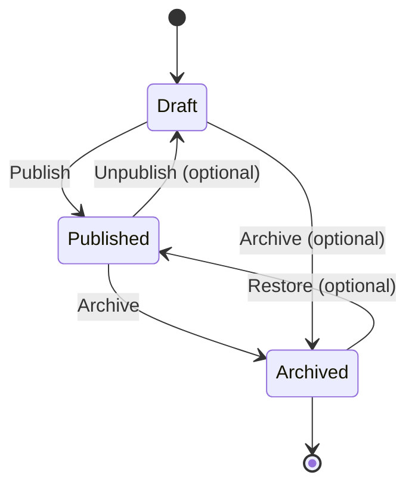
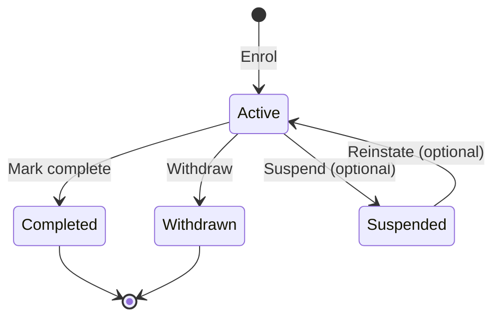
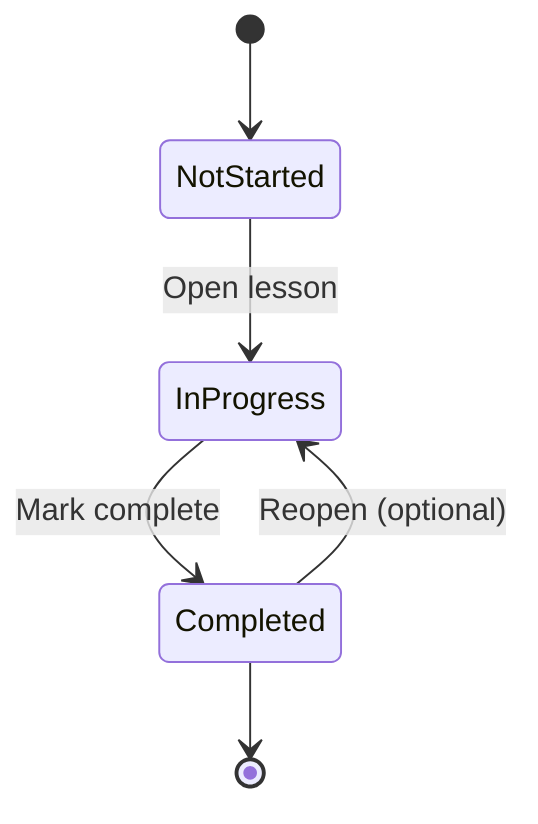
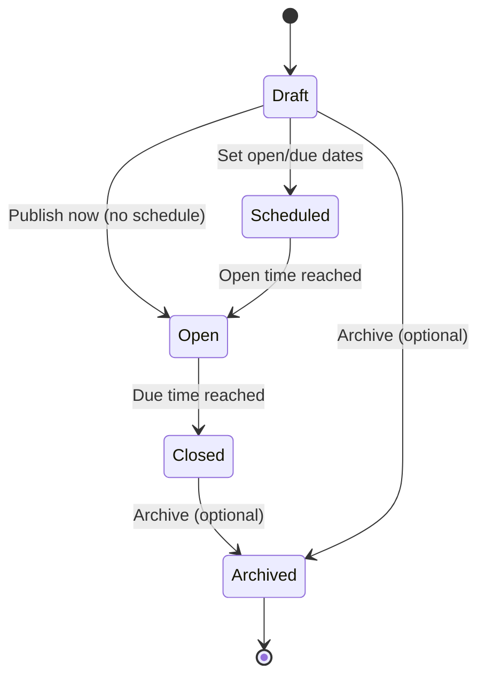
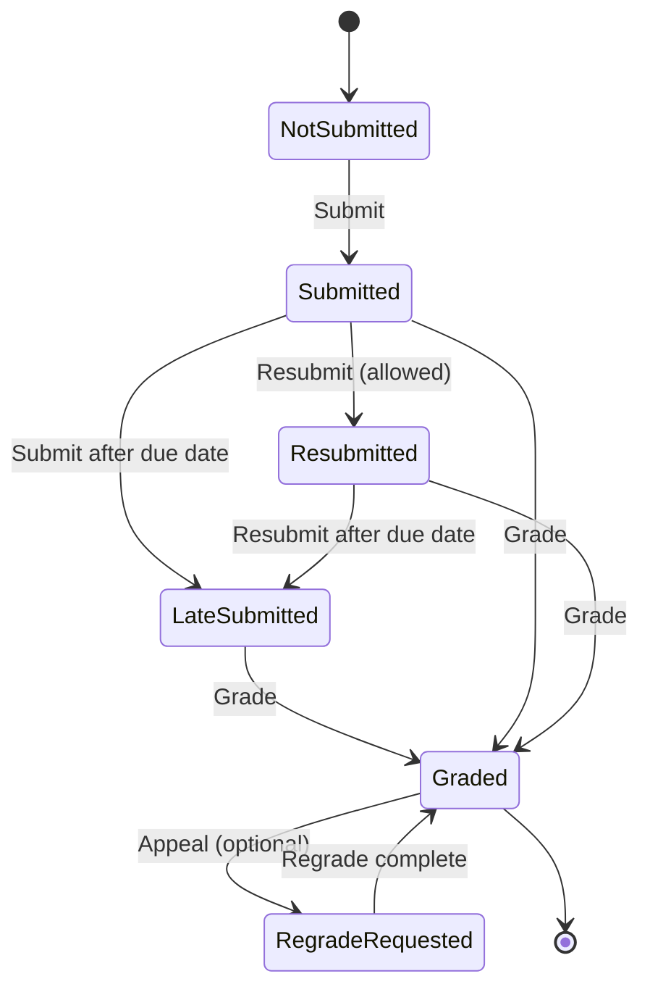
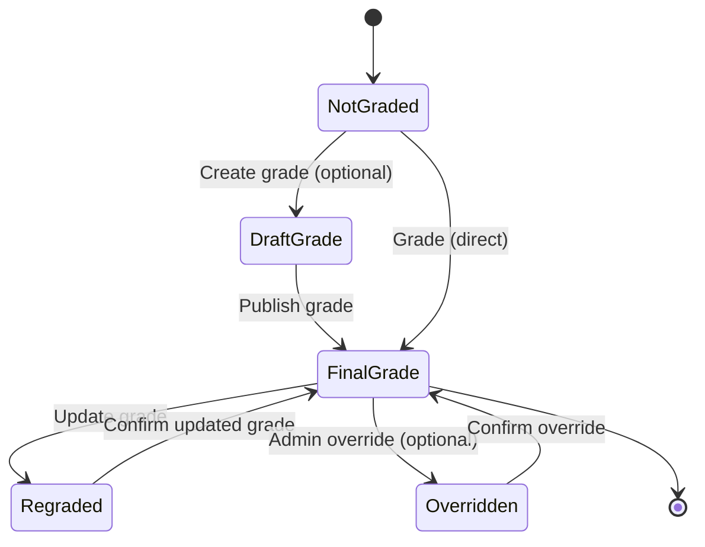
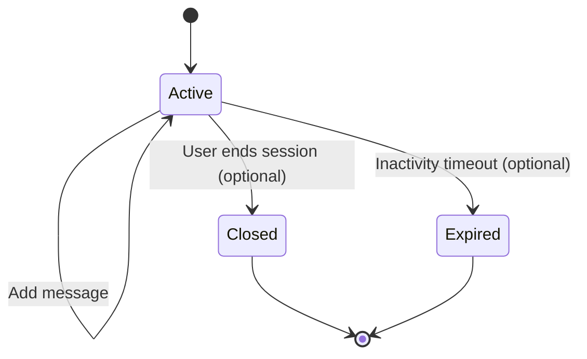

# Noventrax VLE/LMS  
## State Machine Diagrams (Core Lifecycles)

---

## 1. Purpose

This document defines the key **state machines** (lifecycles) required for correct VLE/LMS behaviour.

State machines reduce ambiguity in implementation by clarifying:

- Allowed states
- Valid transitions
- Who can trigger transitions
- What must be logged/audited
- What happens in edge cases (late submissions, regrades, withdrawals)

All diagrams use GitHub-compatible Mermaid syntax.

---

# 2. State Machine 1 — Course Lifecycle

A course moves from drafting to publication and eventually archival.

**Actors**
- Instructor: creates/updates/publishes/archives courses
- Admin: can override (optional)

**Audit**
- Log: publish, archive, restore events

# 3. State Machine 2 - Enrolment lifecycle

Tracks a student's enrolment status in a course
Actors

- Student: self-enrol (if enabled), withdraw
- Instructor/Admin: enrol student, mark completion, withdraw

Audit
- Log: enrolment created, withdrawn, completed

Notes

- “Suspended” is optional (useful for policy enforcement).
- Access control checks should ensure only enrolled students in Active state can access learning materials and submit assessments.

# 4. State Machine 3 - Lesson progress lifecycle
Tracks completion for an individual lesson per enrolment.
Actors
- student : marks complete
- System: auto-complete

Notes
- "Reopen" can be allowed if you want flexible learning, but progress should not be deleted silently (keep timestamps)

# 5. State Machine 4 - Assessment availability lifecycle
Determines whether an assessment can accept submissions.
Actors
- Instructor/Admin: schedules assessment windows

# 6. State Machine 5 - Submission lifecycle (Quiz/Assignment)
Captures submissions and resubmissions, including late handling.
Actors
- Student: submit/resubmit
- Instructor/Admin: allow resubmission (policy-based)
Audit
- Log: initial submit, resubmit, late flag changes

# 7. State Machine 6 — Grading Lifecycle (Governance Focus)

Ensures grade changes are traceable and auditable.
Actors
- Instructor: grade/regrade
- Admin: override (optional)
Audit
- Log: grade created, grade updated, override reason

# 8. State Machine 7 — AI Tutor Chat Session Lifecycle

Manages chat sessions per user and per course context.

Actors
- Student/Instructor: create/use sessions
- System: expire sessions (optional)

# 9. Policy Hooks (Where rules must be enforced)

- Course state controls catalogue visibility (only Published visible to students).

- Enrolment state controls access (only Active can access content and submit).

- Assessment state controls submissions (only Open accepts submissions).

- Submission state controls grading and resubmissions.

- Grade lifecycle controls governance and audit logging.

- Chat session lifecycle controls retention and privacy.
