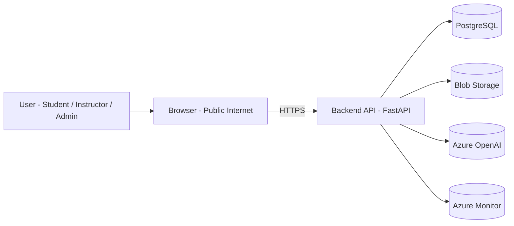

# Noventrax VLE/LMS  
## Threat Model (STRIDE-Based)

---

## 1. Purpose

This document identifies security threats to the Noventrax VLE/LMS and maps them to mitigation controls.

It covers:

- Trust boundaries
- Key attack surfaces
- STRIDE threat analysis
- AI-specific risks
- Required security controls

This threat model supports secure-by-design implementation.

---

# 2. System Trust Boundary Diagram

